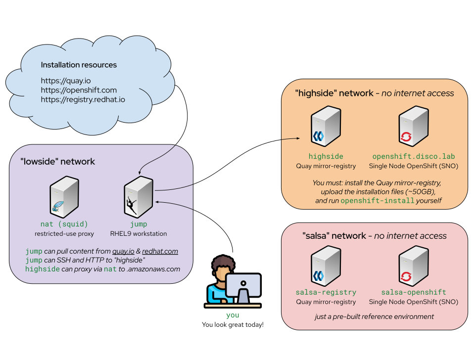

# ocp_disconnected

This repo will have valuable instructions and manifests for an AirGapped OCP Deployment.

## Required Tools:
    - oc-mirror
    - mirror-registry
    - openenshift-install

## OCP Pull Secret
The default path for the pull secret is `~/.docker/config.json`. you can obtain that from https://console.redhat.com/openshift/install/pull-secret

## Running OCP-MIRROR
ocp-mirror --config manifests/ImageSetConfiguration.yaml file://./folder_path

This command will use the ImageSetConfiguration.yaml file to download the installation images and operators.

